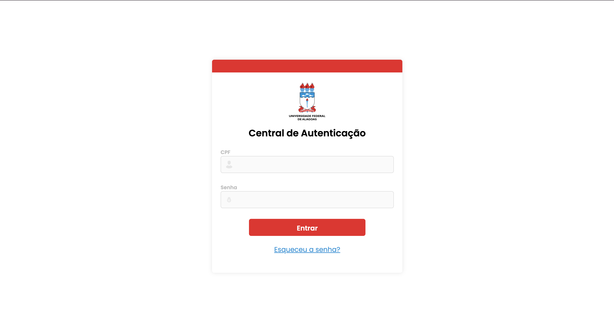
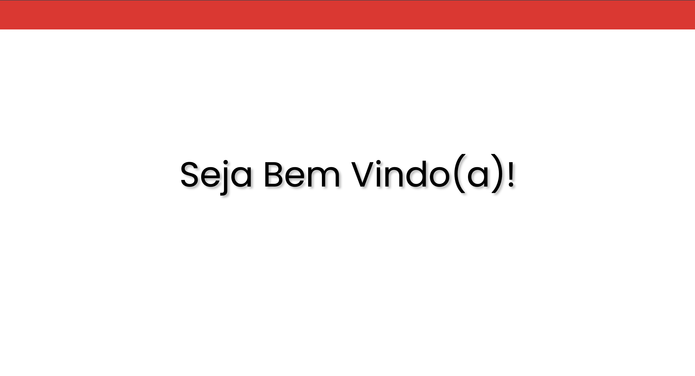

# 🎨 Releitura Login UFAL

<p align="center">
  
  
</p>

## 📜 Sobre o Projeto
Este projeto é uma releitura da tela de login do sistema da Universidade Federal de Alagoas (UFAL), desenvolvido com Angular. O objetivo é criar uma interface moderna e funcional que remeta ao layout original, utilizando boas práticas de desenvolvimento front-end utilizando a documentação do Angular como material de estudo e consulta, para avaliar sua completude diante dos aspectos de abrangência, organização, clareza, atualização, suporte, exemplos e tutoriais.

---

## 🛠 Tecnologias Utilizadas
- **Angular**: Framework principal para construção do front-end.
- **Node v20.8.0**: Versão recomendada para o ambiente de desenvolvimento.
- **CSS**: Para estilização da interface.
- **HTML**: Estrutura das páginas.
- **Figma**: Para a prototipação [Acessar o protótipo](https://www.figma.com/design/I1R0zT5RMBgenDhWbl67iT/Untitled?node-id=5-2&t=88uwmLIWK1I3tha6-1)

---

## 🚀 Como Rodar o Projeto
1. **Clone o Repositório**:
   ```bash
   git clone https://github.com/JuniorVinicius/ufal-login-angular.git

2. **Instale as Dependências:
	```bash
	cd nome-do-projeto
	npm install

3. **Inicie o Servidor de Desenvolvimento:
	```bash
	ng serve

## 🧩 Requisitos Funcionais

- **RF001 - Credenciais**  
  O sistema deve permitir que o usuário insira um CPF e uma senha.

- **RF002 - Validação de Campos**  
  O sistema deve validar os campos de CPF e senha, garantindo que não estejam vazios antes de permitir a submissão do formulário.

- **RF003 - Autenticação do Usuário**  
  O sistema deve verificar se o CPF e senha correspondem a um usuário cadastrado.

- **RF004 - Mensagens de Erro**  
  - O sistema deve exibir uma mensagem de erro "CPF ou senha incorretos" se as credenciais fornecidas forem inválidas.
  - O sistema deve exibir uma mensagem de erro "Campo obrigatório" se qualquer campo obrigatório não for preenchido.

- **RF005 - Redirecionamento Pós-Login**  
  O sistema deve redirecionar o usuário para a página inicial após um login bem-sucedido.

- **RF006 - Feedback ao Usuário**  
  O sistema deve fornecer feedback visual ao usuário sobre o status da tentativa de login, como mensagens de carregamento e sucesso ou erro na autenticação.

## 📸 Screenshots

| Tela de Login                     | Tela de Inicial (Boas Vindas)                 |
|-----------------------------------|-------------------------------------|
|  |  |


## 📝 Notas
> Este projeto é um exercício de releitura e não está vinculado oficialmente ao sistema da UFAL.
